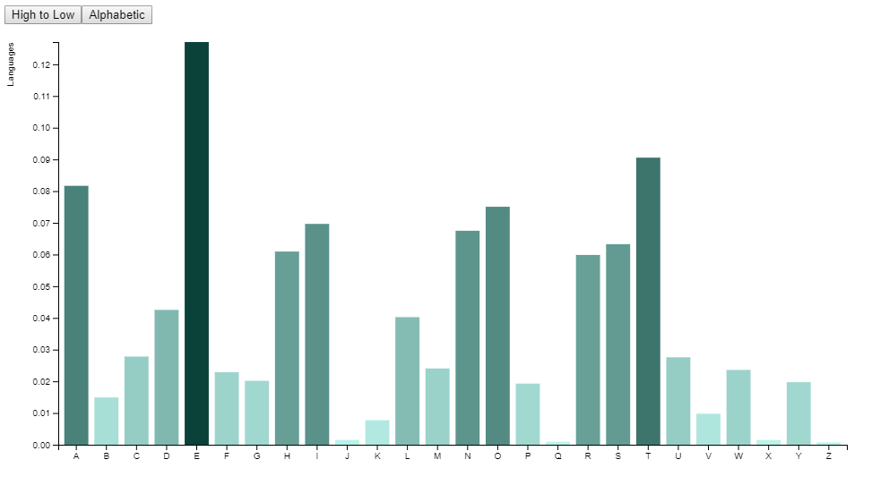

# Sort
This is simple bar chart visualizing the percentage of the letters from the alphabet. This chart was based on [**bl.ock**](https://bl.ocks.org/d3noob/bdf28027e0ce70bd132edc64f1dd7ea4) by [@mbostock](https://github.com/mbostock).



## Data
Tab-separated values (TSV) with 27 rows and two columns:

* 'letter' — Each letter in the alphabet
* 'frequency' — Number describing how frequent the corresponding letter
occurs in the English language

## Features
* ['d3-array'](https://github.com/d3/d3-array#api-reference)
— 'd3.max' and 'd3.ascending'
— Array statistics and searching
* ['d3-axis'](https://github.com/d3/d3-axis#api-reference)
— 'd3.axisBottom' and 'd3.axisLeft'
— Reference marks for scales
* ['d3-scale'](https://github.com/d3/d3-scale#api-reference)
— 'd3.scaleBand' and 'd3.scaleLinear'
— Position encodings
* ['d3-selection'](https://github.com/d3/d3-selection#api-reference)
— 'd3.select'
— Select elements
* ['d3-timer'](https://github.com/d3/d3-timer#api-reference)
— 'd3.timeout'

## changes made
The sort changes I used [this code](https://github.com/cmda-tt/course-17-18/tree/master/site/class-1-bar/wooorm#readme) as a reference
* I made 2 sort functions.
- One to sort it by the value, so from high to low
```
function highToLow() {
var x0 = x.domain(data.sort(sortOnFrequency).map(letter)).copy();
var transition = svg.transition();
```
- Another to sort on alfabetical order.
```
function Alphabetic() {
var x0 = x.domain(data.sort(sortOnLetter).map(letter)).copy();
var transition = svg.transition();
```
* Added a meaningful color to the graph.
```
var colors = d3.scaleLinear()
.domain([0, d3.max(data, function(d) { return d.frequency; })])
.range(["#BCF4EC", "#0A4239"]);
```

## License
GPL-3.0 © Luisa Braga dos Santos
